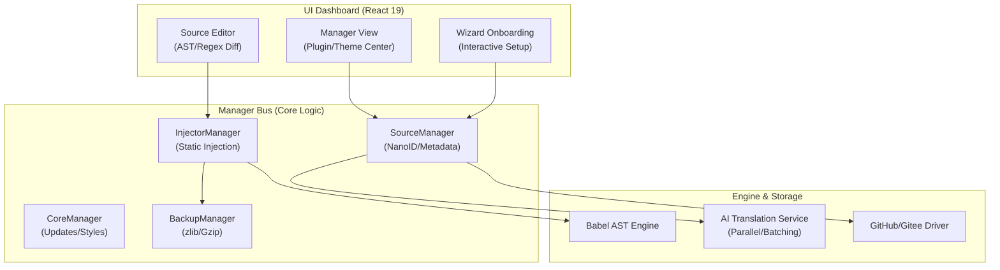

# 💎 Obsidian i18n v2.0
### The Ultimate Industrial-Grade Localization Suite

 

**「 不止于翻译，更是生态的重构 」**
 
基于 **AST 语法树** 的编译级提取，配合 **AI 并行加速** 与 **BackupSync 2.0**，
为您的 Obsidian 提供最专业、最稳健、最优雅的多语言本地化方案。

---

[✨ 特性矩阵](#-特性矩阵) • [🏗️ 架构深潜](#️-架构深潜) • [🧠 核心技术](#-核心技术) • [🚀 极速上手](#-极速上手) • [🔧 进阶指南](#-进阶指南)

---

## ✨ 特性矩阵 (Feature Matrix)

> [!TIP]
> **v2.0 是一次从“脚本”到“系统”的代际跨越。**

| 核心特性 | 深度描述 | 价值收益 |
| :--- | :--- | :--- |
| **AST 自动机** | 基于 Babel 的代码流重写引擎，智能感知 UI 上下文 | **0 崩溃风险**，精准命中 UI 文本 |
| **AI 并行调度** | 并发 Batch 翻译 + Zod 严格 Schema 校验 | 速度提升 **300%**，100% 格式正确 |
| **BackupSync 2.0** | 增量 Gzip 备份 + GitHub API 极速同步 | 数据永不丢失，跨设备秒级对齐 |
| **资源全覆盖** | 原生支持插件 (Plugins) 与 **主题 (Themes)** 翻译 | 真正的全界面 100% 汉化 |
| **智能 Wizard** | 交互式新手引导流，配置过程丝滑顺畅 | 开箱即用，无需阅读厚重手册 |

---

## 🏗️ 架构深潜 (Technical Architecture)

v2.0 引入了**服务中台化 (Manager-Based)** 架构，确保了高内聚与低耦合：

---

## 🧠 核心技术 (Core Technologies)

<b>1. 编译级提取引擎 (AST Extraction Engine)</b>

 
传统的正则匹配（Regex）在处理混淆代码时极易误伤逻辑常量。2.0 的 **AST 引擎** 会像编译器一样解析 `main.js`：
- **语义识别**：区分代码逻辑字符串与用户界面字符串。
- **白名单机制**：利用 `VariableDeclarator`, `AssignmentExpression` 等路径进行精准过滤。
- **非破坏性更新**：仅修改关键节点，保持原有代码逻辑的完整性。

<b>2. AI 工业级翻译套件 (AI Suite)</b>

 
集成 OpenAI 兼容接口，通过 Zod 强类型校验确保译文质量：
- **批处理 (Batching)**：利用分词器对内容进行分片，单次请求并发处理多个词条。
- **上下文感知**：翻译时自动携带词条所属的文件名、键名等元数据，提升语境准确度。
- **状态回显**：翻译进度实时同步至 UI。

<b>3. BackupSync 2.0 同步系统</b>

 
基于 Git 思想构建的本地与云端同步链路：
- **Checkpoint**：在长耗时的备份过程中自动保存检查点。
- **Gzip 压缩**：多文件打包压缩存入 `.js.gz`，极大地节省了 GitHub 仓库空间。
- **冲突预防**：同步前自动校验 `metadata.json` 指纹，避免版本错乱。

---

## 🚀 极速上手 (Quick Start)

### 1. 初始化向导
首次启用时，**Wizard** 会自动弹出。您只需填入 GitHub Token，系统将自动创建翻译资源库。

### 2. 扫描与翻译
- 进入 **Manager 面板**。
- 找到想要翻译的插件，选择 **AST 模式**（Beta/推荐）进行扫描。
- 点击“AI 翻译”，稍等片刻，专业本地化译文即可就绪。

### 3. 应用变更
点击 **“注入”**。系统会：
1. 自动创建 Gzip 备份。
2. 将译文硬编码入目标文件。
3. 自动重载插件（无需手动重启 Obsidian）。

---

## 🔧 进阶指南 (Advanced Guide)

### 过滤规则自定义
在设置中，您可以调整 **Regex/AST 过滤器**：
- `astValidRe`: 强制捕获匹配此正则的字符串。
- `astRejectRe`: 屏蔽所有包含特定关键词的字符串（如 ID、URL、变量）。

### AI 性能调优
- **Batch Size**: 默认 50，可根据模型 Token 限制进行调整。
- **Concurrency Rate**: 动态调整并行请求数，平衡速度与速率限制（Rate Limit）。

---

## ❓ 常见问题 (FAQ)

<b>注入翻译后插件打不开怎么办？</b>

点击“还原 (Restore)”按钮。系统会立即解压 `.js.gz` 备份文件，瞬时恢复到注入前的原始状态。

<b>为什么 AST 提取的词条比 Regex 少？</b>

这是正常的。AST 提取是通过语法结构过滤掉非 UI 字符串，虽然数量少，但准确率更高且更安全。

---

## 📄 License & Credits

- 本项目采用 **MIT License**。
- 感谢 [OpenAI](https://openai.com/), [Babel](https://babeljs.io/), [React](https://reactjs.dev/) 等卓越的工具。
- 核心灵感源自对 Obsidian 无障碍生态的极致追求。

---

  
**Proudly built with ❤️ for Obsidian Community.**

[参与项目贡献](https://github.com/0011000000110010/obsidian-i18n/pulls) | [反馈问题](https://github.com/0011000000110010/obsidian-i18n/issues)

